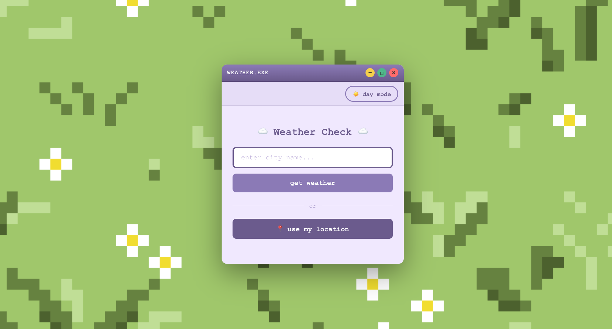
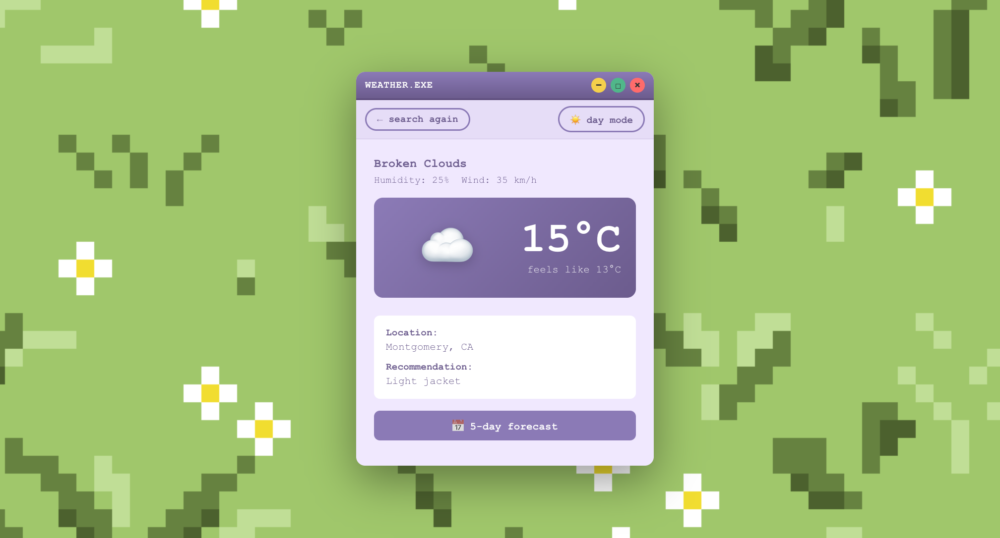
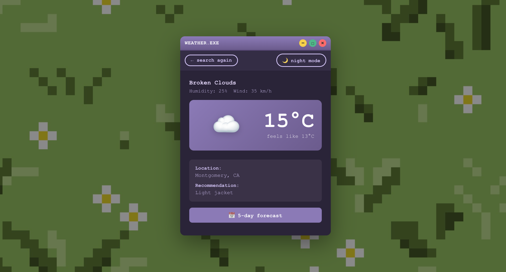
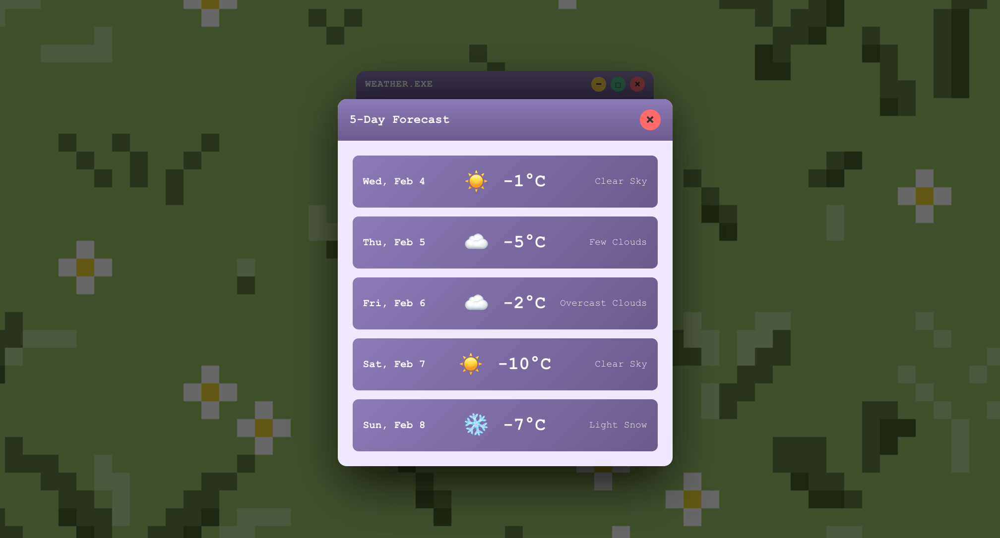

# ☁️ Cute Weather Display App

A fun and interactive weather application built with React that displays real-time weather data with a charming retro-inspired interface. Features custom pixel art backgrounds and a day/night mode toggle for an enhanced user experience.

## 🌟 Features

### Core Functionality
- **Real-time Weather Data** - Displays current weather conditions, temperature, humidity, wind speed, and "feels like" temperature for any location using the OpenWeatherMap API
- **Location Search** - Search for weather information for any city or location around the world
- **Geolocation Integration** - Automatically detects your current location and displays local weather
- **5-Day Weather Forecast** - View a detailed 5-day forecast in a popup overlay
- **Clothing Recommendations** - Get personalized clothing suggestions based on current temperature

### Design Features
- **Day/Night Mode Toggle** - Switch between light and dark themes with custom backgrounds
- **Custom Pixel Art Backgrounds** - Hand-crafted pixel art backgrounds for both day and night modes
- **Retro Window Interface** - Nostalgic OS-style window with minimize, maximize, and close buttons
- **Responsive Design** - Fully responsive layout that works on desktop and mobile devices
- **Smooth Animations** - Polished UI with smooth transitions and popup animations

## 🛠️ Tech Stack
- **React** - Frontend framework
- **JavaScript (ES6+)** - Programming language
- **CSS3** - Styling with custom animations
- **OpenWeatherMap API** - Real-time weather data
- **HTML5 Geolocation API** - Location detection

## 🚀 Deployment

This app is deployed on Netlify. See it [here](https://yanisa-weather.netlify.app).

Note: This app uses OpenWeather API. You must make your own API key to run locally.

## 📸 Screenshots

### Day Mode

### Night Mode

### 5-Day Forecast

## 🎨 Custom Assets

All background images and designs were custom-made for this application:
- `day-bg.PNG` - Custom pixel art daytime background with grass and flowers
- `night-bg.jpg` - Custom pixel art nighttime background

## 📱 Usage

1. **Search by City**: Enter any city name in the search box and click "get weather"
2. **Use Your Location**: Click the "📍 use my location" button to get weather for your current location
3. **Toggle Day/Night**: Click the ☀️/🌙 button to switch between light and dark modes
4. **View Forecast**: Click "📅 5-day forecast" to see the extended weather forecast
5. **Search Again**: Click "← search again" to return to the search screen

## 👩‍💻 Author

**Yanisa Srisa-ard**
- Portfolio: [yanisa.netlify.app](https://yanisa.netlify.app)
- GitHub: [@yanisasri](https://github.com/yanisasri)
- LinkedIn: [linkedin.com/in/yanisa](https://linkedin.com/in/yanisa)

## 🙏 Acknowledgments

- Weather data provided by [OpenWeatherMap](https://openweathermap.org/)
- Custom pixel art backgrounds designed and created by Yanisa Srisa-ard
- Inspired by retro operating systems and cozy weather apps

## 📝 Notes

This is a hobby project created to practice React development and API integration. All designs, including the pixel art backgrounds, were custom-made for this application.
